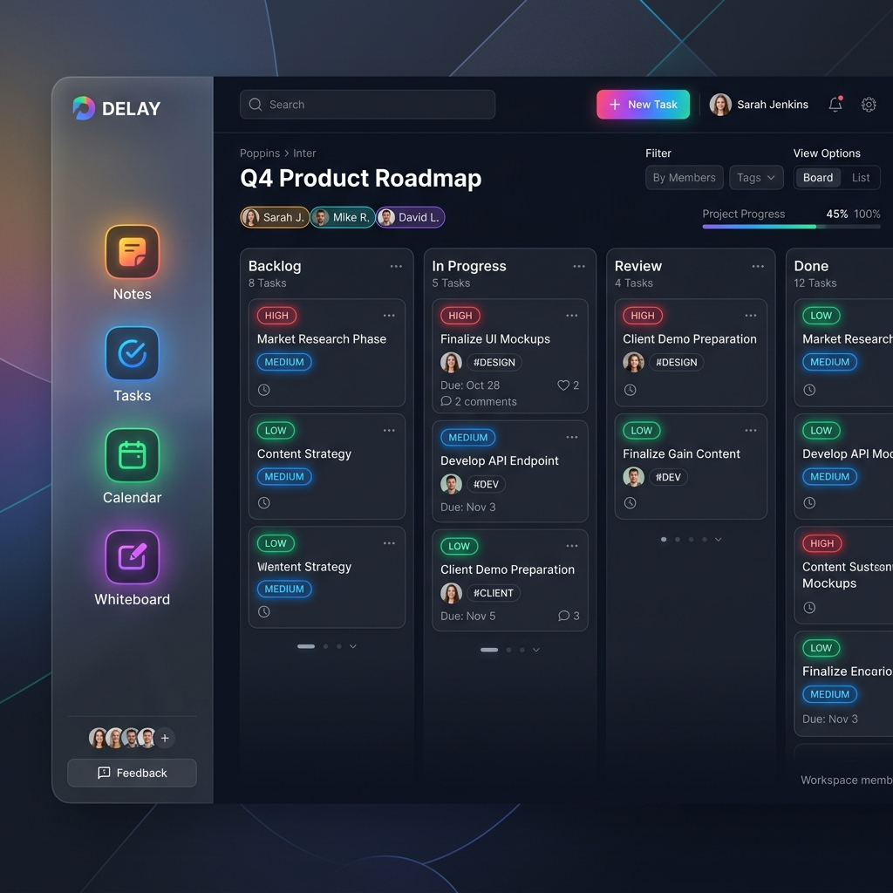
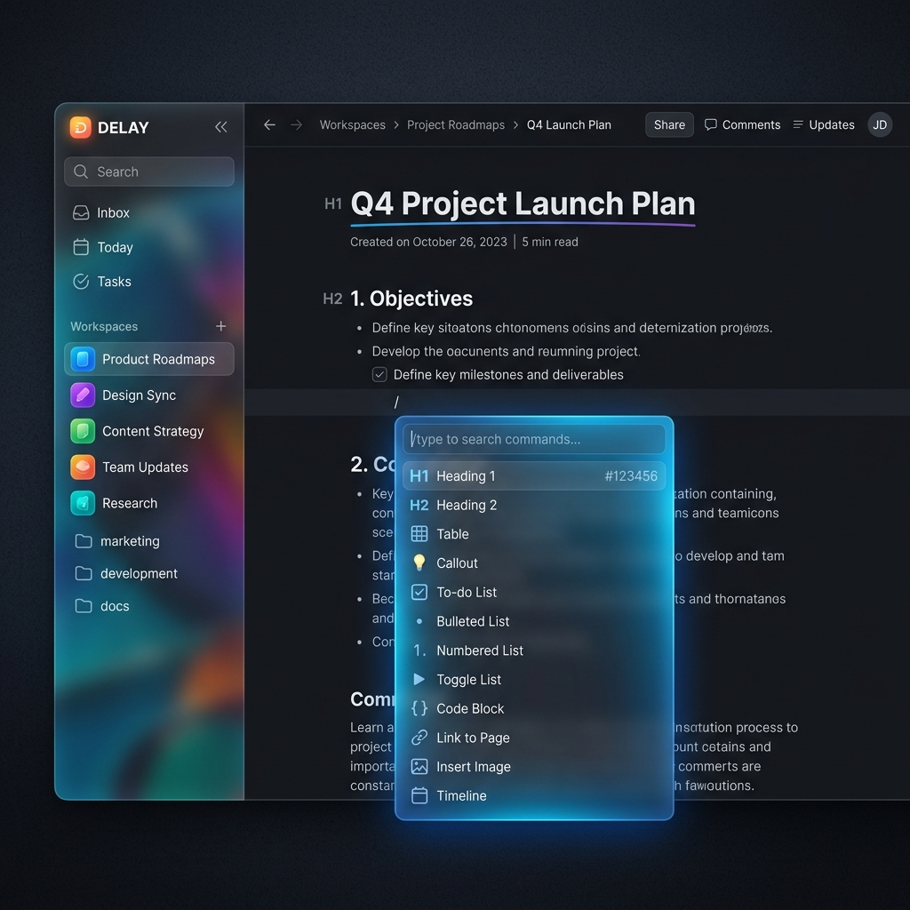

<div align="center">


# Delay

**The cross-platform Agentic OS for productivity.**

Made with ❤️ by **AlpSoft Team**

Notes · Tasks · Calendar · Timer · Code Studio · Whiteboard · AI Agent

[](https://github.com/AzizX-coder/Delay/releases/latest)
&nbsp;
[](LICENSE)

[Landing Page](https://azizx-coder.github.io/Delay/) · [Releases](https://github.com/AzizX-coder/Delay/releases) · [Report a bug](https://github.com/AzizX-coder/Delay/issues)

---

### Support Our Work!

If you find Delay helpful and want to support the AlpSoft team, consider buying us a coffee! Your support helps us keep the app 100% free and open-source.

<a href="https://www.buymeacoffee.com/alpsoft" target="_blank"></a>

</div>

---

## ✨ What is Delay?

Delay is a **super free cross-platform Agentic OS** that combines **10 modular workspaces** — notes, tasks, calendar, timer, kanban, whiteboard, code studio, voice studio, bucket, and capture — all unified behind an **autonomous AI Agent**. It is available on Desktop, Web, and Mobile (PWA).

Everything can live locally on your device or sync via the cloud, giving you ultimate flexibility and security.

## 📸 Screenshots & Documentation

<div align="center">
  
  
</div>

### 1. 🤖 AI Agent (Ollama + Cloud)
A unified autonomous agent with file control, terminal execution, and 20+ tools. You can choose to run local models with Ollama for extreme privacy, or connect to OpenRouter/Cloud APIs for advanced LLM capabilities.

### 2. 📝 Notes & Capture
- **Notes**: TipTap docs with 13 slash commands. Export to Markdown, HTML, and TXT. Features 10 built-in templates (Weekly Review, Bug Report, etc.) and voice dictation.
- **Capture (Global)**: Hit `Ctrl+Shift+S` anywhere to quickly capture an idea, task, or note to your inbox.

### 3. ✅ Tasks & Kanban
- **Tasks**: Priority flags, due dates, Inbox/Today/Upcoming smart views, and custom lists. Tasks grant XP points for completion.
- **Kanban**: Full drag-and-drop boards, custom columns, color labels, and activity logs.

### 4. 📅 Calendar & Timer
- **Calendar**: Unified events and tasks across Month, Week, and Day views.
- **Timer + Goals**: Pomodoro timer with purpose-driven goals, focus scheduling, and multi-day tracking.

### 5. 🎨 Whiteboard
A fully interactive, infinite canvas powered by `tldraw`. Create sticky notes, shapes, use pens, pan/zoom, and organize visually.

### 6. 💻 Code Studio
A VS Code-like IDE workspace featuring Monaco Editor, a file tree, built-in terminal, and an AI coding agent directly in the browser/app.

### 7. 🔒 Bucket
Secure local file storage. Keep your documents, images, and important files organized inside secure folders on your device.

### 8. 🎮 Gamification
Turn productivity into a game! Earn XP for completing tasks, writing notes, and finishing focus sessions.

---

## 📥 Download & Installation

Grab the latest **Delay-Setup-3.0.0.exe** from the [Releases](https://github.com/AzizX-coder/Delay/releases/latest) page, or visit the [landing page](https://azizx-coder.github.io/Delay/).

**Requirements:** Windows 10 or 11 (x64), macOS, Linux, or modern Web Browser.
Optional: [Ollama](https://ollama.com/) for local AI features.

### 🛡️ Windows SmartScreen — "Windows protected your PC"

Delay is built by an independent developer and is **not yet code-signed with a paid EV certificate**. On first launch, Windows may show a blue SmartScreen banner. 

**To install safely:**

1. Download the latest `.exe` from [Releases](https://github.com/AzizX-coder/Delay/releases/latest).
2. Double-click the installer. If SmartScreen appears, click **More info → Run anyway**.
3. Follow the NSIS installer.

## 🔒 Security
Delay implements device safety measures:
- The Electron App runs in a strict **Sandbox** (`sandbox: true`).
- A secure **Content-Security-Policy (CSP)** is enforced.
- Context Isolation is enabled with node integration disabled on the frontend.

## 🛠️ Tech Stack

| Layer | Technology |
|-------|-----------|
| Shell | Electron 41 |
| Web/PWA | React 19 · TypeScript · Vite 8 · Vite PWA Plugin |
| Styling | Tailwind CSS v4 · custom Liquid UI variables |
| State | Zustand |
| Storage | Supabase (Cloud) + Dexie.js (Local) |
| Editor | TipTap · Monaco Editor · Tldraw |
| Animation | Motion (Framer Motion) |
| Packaging | electron-builder · GitHub Actions |

## 🚀 Build from source

```bash
git clone https://github.com/AzizX-coder/Delay.git
cd Delay
npm install
npm run dev                   # Web development
npm run electron:dev          # Desktop development
npm run electron:build        # Windows installer → release/
```

## 📄 License

Apache-2.0 © [AzizX-coder](https://github.com/AzizX-coder) and the AlpSoft Team
