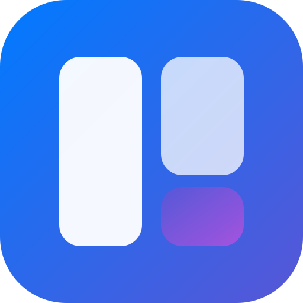

<div align="center">



# Delay

**Notes · Tasks · Calendar · AI — one beautifully local desktop app.**

[](https://github.com/AzizX-coder/Delay/releases/latest)
&nbsp;
[](LICENSE)

[Landing Page](https://azizx-coder.github.io/Delay/) · [Releases](https://github.com/AzizX-coder/Delay/releases) · [Report a bug](https://github.com/AzizX-coder/Delay/issues)

</div>

---

## ✨ What is Delay?

Delay is a local-first desktop app that puts your **notes**, **tasks**, **calendar**, and a built-in **AI assistant** behind one fluid, Apple-Notes-inspired interface. Everything lives on your device — no accounts, no cloud, no tracking.

## 🧩 Features

| Module | Highlights |
|--------|-----------|
| **Notes** | Rich TipTap editor · formatting, checklists, highlights · color-coded notes · zero spell-check underlines |
| **Tasks** | Priorities & due dates · Inbox / Today / Upcoming / Completed smart views · custom lists |
| **Calendar** | Month view · color-coded events · quick scheduling · all-day & timed events |
| **AI** | Chat with local Ollama models · streaming responses · conversation history |
| **Settings** | Theme (light / dark / system) · language · default AI model · auto-update |

## 🖥️ Screenshots

> Screenshots coming soon — run the app yourself to see the Liquid UI in action!

## 📥 Download

Grab the latest **Delay-Setup-1.0.1.exe** from the [Releases](https://github.com/AzizX-coder/Delay/releases/latest) page, or visit the [landing page](https://azizx-coder.github.io/Delay/).

**Requirements:** Windows 10 or 11 (x64). Optional: [Ollama](https://ollama.com/) for AI features.

## 🛠️ Tech Stack

| Layer | Technology |
|-------|-----------|
| Shell | Electron 41 |
| Frontend | React 19 · TypeScript · Vite 8 |
| Styling | Tailwind CSS v4 · custom Liquid UI variables |
| State | Zustand |
| Storage | Dexie.js (IndexedDB) — 100% local |
| Editor | TipTap |
| Animation | Motion (Framer Motion) |
| AI | Ollama HTTP SDK |
| Packaging | electron-builder (NSIS) |

## 🚀 Build from source

```bash
git clone https://github.com/AzizX-coder/Delay.git
cd Delay
npm install
npm run electron:dev          # development
npm run electron:build        # Windows installer → release/
```

## 📁 Project layout

```
├── electron/        # Main process + preload
├── src/             # React app (components, features, stores)
├── public/          # Icons
├── landing/         # GitHub Pages landing site
├── scripts/         # Build helpers (icon conversion)
└── package.json     # Config + electron-builder
```

## 📄 License

MIT © [AzizX-coder](https://github.com/AzizX-coder)
